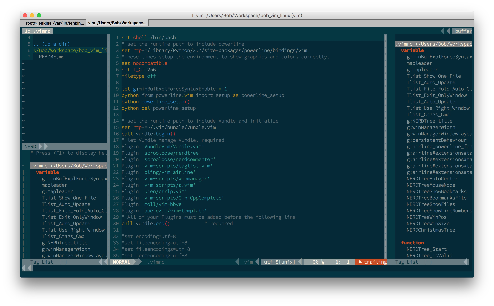

bob_vim_linux
=============

Bob's vim configuration on linux env

goto your $HOME
     
Then excute: 
    
1. 
    git clone https://github.com/baoxiaopan/bob_vim_linux.git ~/bob_vim_linux
    
    git clone https://github.com/VundleVim/Vundle.vim.git ~/.vim/bundle/Vundle.vim

    cp -rf ~/bob_vim_linux/{.vim,.vimrc} ~/

2. 
    Launch vim and run :PluginInstall

    To install from command line: vim +PluginInstall +qall

### Sketch

